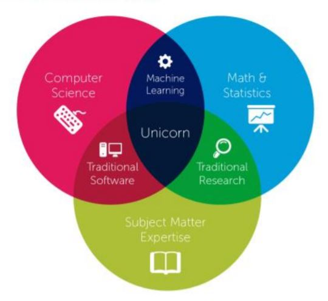

```{r include=FALSE}

library(fontawesome)

```

<center>UNIVERSIDADE FEDERAL DE MINAS GERAIS</center>

<center><medium>Centro de Desenvolvimento e Planejamento Regional</medium></center>

<br>

<center> CIÊNCIA DE DADOS PARA ESTUDOS EM INOVAÇÃO </center>

<br>

<br>

<center> Semestre 2022/1 </center>

<br>

<center> Professor: Rodrigo Fileto Cuerci Maciel </center>

# Aula Introdutória

-   Visão geral da disciplina;
-   Evolução da análise de dados em estudos de inovação;
-   Fontes de dados em estudos de inovação;

## Contexto

Iniciativas como a **Ciência Aberta** e **Dados Abertos Governamentais** disponibilizam quantidade massiva de informações para pesquisadores e para o público em geral.

Em paralelo, novas ferramentas computacionais oferecem grandes possibilidades na extração sistemática e massiva de dados para a análise de fenômenos sociais.

## Objetivos

-   Apresentar técnicas para coleta automatizada de informações;
-   Apresentar um panorama de ferramentas computacionais que podem ser utilizadas para análise de indicadores e políticas de inovação.

## Ciência de Dados: Convergência de disciplinas

```{r echo=FALSE, fig.align='center', out.width='50%'}




```

Fonte: @armengaud2017

## Tópicos da disciplina

1.  Evolução da análise de dados em estudos de inovação

    a.  Conceitos básicos em economia da inovação;

    b.  Evolução do uso de dados em estudos de inovação;

    c.  Fontes de dados para estudos em inovação.

        <p>

         

        </p>

2.  Coleta, processamento e preparação de dados

    a.  Coleta automatizada de dados na web;

    b.  Refinamento e preparação de dados;

    c.  Análise exploratória e descritiva de dados.

        <p>

         

        </p>

3.  Ciênciometria e análise de patentes

    a.  Análise de redes científicas e tecnológicas;

    b.  Dados abertos em ciência;

    c.  Identificação de tópicos científicos e tecnológicos: algoritmos e técnicas;

    d.  Vieses de gênero na pesquisa científica;

    e.  Medidas de interdisciplinaridade;

    f.  Altimetria;

    g.  Avaliação de impacto de financiamento.

        <p>

         

        </p>

4.  Análise de Compras Públicas

    a.  Concentração regional e econômica dos fornecedores;

    b.  Encomenda tecnológica;

        <p>

         

        </p>

5.  Ferramentas de análise de big-data

    a.  Visão geral sobre ferramentas de big-data em R;

        <p>

         

        </p>

6.  Comunicando os resultados

    a.  Princípios para elaboração de gráficos;

    b.  Elaboração de relatórios e artigos científicos.

        <p>

         

        </p>

## Configuração de software

Informações sobre a Instalação do R e Rstudio podem ser acessadas em (<https://rstudio-education.github.io/hopr/starting.html>)

# Economia da Inovação

"O impulso fundamental que configura e mantém a máquina capitalista em movimento vem dos novos bens de consumo, novos métodos de produção ou transporte, os novos mercados, as novas formas de organização industrial que a empreitada capitalista cria" [@schumpeter2008, p. 83]

------------------------------------------------------------------------

Trata-se da *destruição criativa,* fruto das constantes inovações que deixam obsoletos processos e produtos, e em alguns casos a estrutura nas quais eles assentavam sua criação e distribuição, para colocar outros em substituição. Tal processo, longe de se chegar a um estado de equilíbrio, colocaria a sociedade capitalista em constante processo de mudança.

# Tópicos em Economia da Inovação

## Economia da Ciência e tecnologia

```{r echo=FALSE}

knitr::include_graphics("./images/mapa_termo_livro.png")

```

Mapa de termos extraídos do livro Economia da Ciência, tecnologia e Inovação [@rapini2021].

## Conceito de tecnologia

-   Tecnologia como sendo o "conhecimento sobre técnicas, enquanto as técnicas envolvem aplicações desse conhecimento em produtos, processos e métodos organizacionais" [@tigre2014a, p. 74].

-   Abordagem focada no conhecimento tácito e explícito. Tradução desse conhecimento em novos processos e produtos[@choo2003; @takeuchi2008].

-   Processo evolucionário de acumulação e apropriação de conhecimento, o que gera oportunidades mas também travamento em trajetórias tecnológicas seja para indivíduos, organizações ou países [@dosi1982].

## Evolução do campo

-   Estabelecendo a rede de publicações científicas através de pouco mais de um milhão de citações [@desollaprice1965a; @garfield1963]. Projeto financiado pela NSF e NIH;
-   Fundação do periódico *Scientometrics* em 1978.
-   Coleção de 2.000 inovações significativas com validação de especialistas tendo em vista avaliar transferência de conhecimento entre setores industriais [@pavitt1984];
-   Análise de base de dados em larga escala [@small2014; @klavans2011; @boyack2014; @boyack2014a].

------------------------------------------------------------------------

-   Análise de patentes avaliando o impacto do financiamento público dos Estados Unidos.

Narin et. al. [-@narin1997] avaliaram as referências (não-patentes) de **397.660** Patentes registradas no período de 1987-1988. Corredoira et. al. [-@corredoira2018] analisaram **4.311** patentes com financiamento federal e 2.000 amostras *bootstrap* com igual número de patentes sem financiamento federal. Ambos os trabalham chegaram a resultados similares ressaltando a importância das agências governamentais na pesquisa e desenvolvimento de tecnologias.

## Fontes de dados para estudos em inovação

-   Bases de publicações científicas (Web of Science, Scopus, Dimensions, Scielo, dentre outras);
-   Bases de patentes (OCDE, US Patent Office);
-   Bases com indicadores diversos (OCDE, IBGE);
-   Compras Públicas (Portal da Transparência Governo Federal);
-   Atividades legislativas (Dados da ALMG e projeto [UAIDEPUTADO](https://www.uaideputado.app.br/))

## Exemplo de Análise - Scielo

```{r echo=FALSE, fig.align='center'}

knitr::include_graphics("./images/cluster_map.png")


```

Áreas científicas a partir de dados da Scielo. O mapa interativo pode ser acessado em <https://app.vosviewer.com/?json=https://www.dropbox.com/s/bbiev4dw7b99q7y/VOSviewer_3047647339148513852.json?dl=1>

# Outras fontes de informações

`r fa("twitter", fill = "steelblue")` Medidas de felicidade a partir de dados do [twitter](https://cdanfort.w3.uvm.edu/main/hedonometrics.html) [@dodds2011];

`r fa("linkedin", fill = "steelblue")` Mobilidade de mão de obra e concentração de conhecimento em alta tecnologia; [@riebe2020; @park2019]

------------------------------------------------------------------------

`r fa("lightbulb", fill = "steelblue")` Medindo índice de pobreza a partir do consumo de energia elétrica [@steele2017];

`r fa("tools", fill = "steelblue")` Minerar páginas da web para construir bases de dados estruturadas. Exemplo: [Tratados Internacionais de Ciência e Tecnologia dos Estados Unidos com outros países](%5Bhttps://www.state.gov/tias/%5D(https://www.state.gov/2021-tias/)).

# Para a próxima aula

Leitura e execução dos códigos referente ao [Básico da Linguagem de Programação em R](https://ona-book.org/the-basics-of-the-r-programming-language.html)[@mcnulty2022].

# Material de aula

Todo o material de aula bem como *scripts* utilizados encontram-se em repositório aberto no Github.

# Referências
