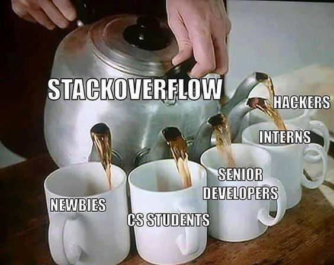

```{r include=FALSE}

library(fontawesome)

```

<center>UNIVERSIDADE FEDERAL DE MINAS GERAIS</center>

<center><medium>Centro de Desenvolvimento e Planejamento Regional</medium></center>

<br>

<center> CIÊNCIA DE DADOS PARA ESTUDOS EM INOVAÇÃO </center>

<center>Coleta e processamento de dados</center>

<br>

<br>

<center> Semestre 2022/1 </center>

<br>

<center> Professor: Rodrigo Fileto Cuerci Maciel </center>

# Objetivos desta aula


-   Trazer um panorama geral de formatos de arquivos dados;
-   Apresentar técnicas de extração automática de dados;
    - Dados de API (**Application Programming Interface**);
    - Mineração de dados na internet (**web scraping**);
    
# Material de aula

O Material desta aula bem como *scripts* utilizados encontram-se em [repositório aberto no Github](https://github.com/rodfileto-ufmg/ciencia_dados_inova/tree/main/02_data_colecao).
    
    

# Formato de arquivos de dados

-   CSV/TSV;
-   XML/HTML;
-   JSON;
-   Parquet;

# Sugestão de fluxo de trabalho para coleta de dados

<center> Necessito de um conjunto de dados: onde procurar? </center>

# Modularização de projetos

# Fontes de pesquisa para programação

-   Github: Para entender o código ou procurar questões sobre pacotes específicos. Exemplos: pacote ["CGE"](https://cran.r-project.org/web/packages/CGE/CGE.pdf) para Equilíbrio Geral Computável e pacote ["economiccomplexity"](https://cran.r-project.org/web/packages/economiccomplexity/index.html); 
-   Stackoverflow: questões gerais que podem ser feitas diretamente no Google;

```{r echo=FALSE, fig.align='center', out.width="40%"}




```

# Coletando dados através de pacotes no R

Alguns pacotes no R servem como interface para extrair dados de API's específicos. Trataremos aqui das seguintes bases:

-   Organização para a Coperação e Desenvolvimento Econômico (OCDE) - [*OECD DATA*](https://data.oecd.org/){target="_blank"};
-   Indicadores do Banco Mundial - [*WDI*](https://datatopics.worldbank.org/world-development-indicators/){target="_blank"};

# Coleta de dados diretamente em API

Caso da Assembléia Legislativa de Minas Gerais

http://dadosabertos.almg.gov.br/ws/proposicoes/ajuda#tiposProposicao

## Pacotes utilizados

```{r echo = T, results='hide', warning=FALSE, message=FALSE}

library(httr)
library(jsonlite)
library(tidyverse)

```

## Preparando a estrutura de arquivos

Definir o tipo de proposição a ser extraída conforme nomenclatura disponível na página de [dados abertos da ALMG](http://dadosabertos.almg.gov.br/ws/proposicoes/ajuda#tiposProposicao){target="_blank"}. Em seguida, criar estrutura de arquivos onde serão salvos os dados coletados tendo em vista uma melhor organização do projeto.


```{r echo = T, results='hide', warning=FALSE, message=FALSE}

# Definir o tipo de proposição a ser extraída conforme 
# nomenclatura disponível em http://dadosabertos.almg.gov.br/ws/proposicoes/ajuda#tiposProposicao

tipo <- "PL"

dir.create("./02_data_colecao/dados/ALMG/")

dir.create(paste0("./02_data_colecao/dados/ALMG/", tipo))

```

## Função geral


```{r echo = T, results='hide', warning=FALSE, message=FALSE}


baixar_base <- function(ano) {
  
  # 1a parte:
  # Identificar o número de registros existentes para determinado ano
  # Calcular o número de interações necessárias
  
  extrair_paginas <- function(pagina) {
    
    # 2a parte: 
    # Extrair em blocos de 100 todos os registros para determinado ano  
  }
  
  # 3a parte:
  # Unificar os resultados das interações
  
}

```


## Número de registros existentes


```{r eval=FALSE}

# endereço de lista de projetos de lei
# Situação do trâmite configurada para "2" = todas

url <- paste0("http://dadosabertos.almg.gov.br/ws/proposicoes/pesquisa/direcionada?ano=", ano, "&sitTram=2&tipo=", tipo, "&formato=json&p=1")
  
  
nr_resultados <- GET(url)
  
nr_resultados <- rawToChar(nr_resultados$content) %>%
  fromJSON(flatten=TRUE) %>%
  .$resultado %>%
  .$noDocumentos %>%
  as.numeric()
  
nr_paginas <- ceiling(nr_resultados/100)


```


## Verificação para continuação do script

```{r eval=FALSE}

if (length(nr_paginas) != 0) {
  
  extrair_paginas <- function(pagina) {
  
  # Código para extrair conteúdo de cada página
  
  }
  
}


```


## Função para extrair dados de cada página

```{r eval=FALSE}

extrair_paginas <- function(pagina) {
  
  url_pagina <- paste0("http://dadosabertos.almg.gov.br/ws/proposicoes/pesquisa/direcionada?ano=", ano, "&sitTram=2&tipo=", tipo, "&formato=json&tp=100&p=", pagina)
  
  dados_json <- GET(url_pagina)
  
  if(dados_json$status_code == 200) {
    
    tabela <- content(dados_json, "text", encoding = "UTF-8") %>%
      fromJSON(flatten=TRUE)
    
    tabela <- as_tibble(tabela$resultado$listaItem) %>%
      mutate_all(as.character)
    
    Sys.sleep(5)
    
  } 
  
  else {
  
  tabela <- tibble(dominio = as.character(pagina), ano = as.character(ano))
  
}
```

## Executar função de forma interativa

```{r eval=FALSE}

baixar_base <- function(ano) {
  
  # 1a parte:
  # Identificar o número de registros existentes para determinado ano
  # Calcular o número de interações necessárias
  
  extrair_paginas <- function(pagina) {
    
    # 2a parte: 
    # Extrair em blocos de 100 todos os registros para determinado ano  
  }
  
  # 3a parte:
  # Unificar os resultados das interações
  
  tabela <- map(1:nr_paginas, extrair_paginas) %>% # Coleta dados de cada página
    bind_rows() # Unifica a lista de tabelas em um dataframe
  
  # Escreve os resultados para a pasta do tipo de proposição
  write_csv(tabela, paste0("./02_data_colecao/dados/ALMG/", tipo, "/", ano, ".csv"))
  
}

```


# Mineração de dados de websites


