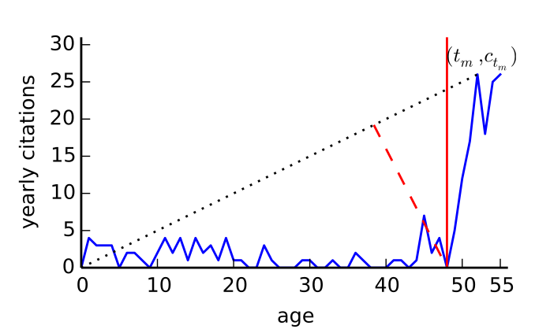

```{r include=FALSE}

library(visNetwork)
library(kableExtra)

```

<center>

UNIVERSIDADE FEDERAL DE MINAS GERAIS

</center>

<center>

<medium>Centro de Desenvolvimento e Planejamento Regional</medium>

</center>

<br>

<center>

CIÊNCIA DE DADOS PARA ESTUDOS EM INOVAÇÃO

</center>

<br>

<center>

Módulo: **Cienciometria e análise de patentes**

</center>

<br>

<center>

Semestre 2022/1

</center>

<br>

<center>

Professor: Rodrigo Fileto Cuerci Maciel

</center>

# Objetivos desta aula

-   Apresentar alguns conceitos básicos de rede;

-   Discorrer sobre tópicos em cienciometria e análise de patentes.

# Material de aula

O Material desta aula bem como *scripts* utilizados encontram-se em [repositório aberto no Github](https://github.com/rodfileto-ufmg/ciencia_dados_inova/tree/main/03_cienciometria/apresenta%C3%A7%C3%A3o){target="_blank"}.

# Tópicos

1.  Dados abertos em ciência;

2.  Identificação de tópicos científicos e tecnológicos: algoritmos e técnicas;

3.  Emergência tecnológica;

4.  Vieses de gênero na pesquisa científica;

5.  Medidas de interdisciplinaridade;

6.  Altimetria;

7.  Avaliação de impacto de financiamento.

# Conceitos básicos em rede

Uma rede $(N, g)$ consiste num conjunto de nós (também chamados de vértices) $N = \{1,...,n\}$ e uma matriz $A$ definida para ser uma matriz $n \times n$ na qual $A_{ij}$ representa a relação entre $i$ e $j$. Esta matrix é comumente referida como *matriz de adjacência*, na qual

$$
    A_{ij}= 
\begin{cases}
    1 ,& \text{se } \text{existe uma relação entre os vértices i e j,}\\
    0,              & \text{de outra forma}
\end{cases}
$$

<center>

Matriz adjacente de uma rede hipotética não valorada e não direcionada

</center>

$$\begin{bmatrix}
0&1&0 \\
1&1&1 \\
0&1&0 \\
\end{bmatrix}$$

<br>

<center>

Representação gráfica da Matriz acima

</center>

<center>

```{r echo=TRUE, out.width="50%"}
library(visNetwork)
nodes <- data.frame(id = 1:3, label = as.character(1:3))
edges <- data.frame(from = c(1,2), to = c(2,3))
visNetwork(nodes, edges, width = "50%", height = 400) %>%
  visInteraction(dragView = TRUE, dragNodes = FALSE, zoomView = FALSE)

```

</center>

## Redes valoradas

As redes não valoradas e não direcionadas apontam para relações binárias entre os vértices da rede (a ligação existe ou não existe). Em alguns casos torna-se útil representar as ligações como possuindo força, peso, ou similaridade, utilizando um número real.

Pode-se converter similaridade para comprimento calculando-se recíprocos (inversos multiplicativos) e utilizando aqueles valores como elementos da matriz adjacente, embora isso deva ser considerado como uma transformação aproximada. Na maioria dos casos não há relação matemática formal entre ligações de força e comprimento.

## Redes direcionadas

Uma rede é *direcionada* se é possível que $A_{ij} \neq A_{ji}$ (Em geral uma matriz não simétrica). A matriz adjacente de uma rede direcionada tem como elementos

$$
    A_{ij}= 
\begin{cases}
    1 ,& \text{se } \text{existe uma ligação do vértice j para i,}\\
    0,              & \text{de outra forma}
\end{cases}
$$

Note-se que a direção da ligação parte do segundo elemento para o primeiro.

<br>

<center>

Matriz adjacente de uma rede hipotética direcionada

</center>

$$\begin{bmatrix}
0&1&0 \\
0&0&0 \\
0&1&0 \\
\end{bmatrix}$$

<br>

<center>

Representação gráfica da Matriz acima

</center>

<center>

```{r echo=TRUE, out.width="50%"}
nodes <- data.frame(id = 1:3, label = as.character(1:3))
edges <- data.frame(from = c(1,2), to = c(2,3), arrows = c("from", "to"))
visNetwork(nodes, edges, width = "50%", height = 400) %>%
  visInteraction(dragView = TRUE, dragNodes = FALSE, zoomView = FALSE)

```

</center>

## Rede Bipartida

A rede bipartida é aquele com dois tipos diferentes de vértices e cujas ligações ocorrem apenas entre vértices de diferentes tipos. Neste caso, a rede bipartida é uma matriz retangular chamada de matriz incidente na qual

$$
    B_{ij}= 
\begin{cases}
    1 ,& \text{se } \text{item j pertence ao grupo i,}\\
    0,              & \text{de outra forma}
\end{cases}
$$

Caso queira-se trabalhar com vértices de apenas um tipo, a projeção de *um modo* da forma bipartida pode ser realizada através da operação $P = B^TB$. A matriz $n \times n$ resultante funciona de maneira similar à uma matriz adjacente. A diagonal apresenta valores igual ao número de grupos que cada vértice pertence.

## Componentes

A rede não precisa consistir em apenas um único conjunto conectado de vértices. Muitas redes possuem duas ou mais partes separadas que estão disconectadas e não possuem ligações entre seus elementos.

<center>

Exemplo de rede com dois componentes

</center>

<center>

```{r echo=TRUE, out.width="50%"}
nodes <- data.frame(id = 1:5, label = as.character(1:5))
edges <- data.frame(from = c(1,2,4), to = c(2,3,5))
visNetwork(nodes, edges, width = "50%", height = 400) %>%
  visInteraction(dragView = TRUE, dragNodes = FALSE, zoomView = FALSE)
```

</center>

## Comunidades em rede

-   Embora haja várias definições para o problema de clusterização, a mais comum declara que um cluster corresponde para um conjunto de vértices com mais ligações dentro do conjunto que com o restante da rede. Ou seja, a densidade dentro da comunidade é maior que entre as comunidades [@fortunato2016; @malliaros2013].

-   Para validação de algoritmos com metadados é preciso atentar se [@peel2016]:

    -   os metadados são irrelevantes para a estrutura da rede;

    -   os metadados e as comunidades capturam diferentes aspectos da estrutura da rede;

    -   Falta estrutura de grupo na rede.

## Exemplos de redes

```{r}

tibble::tibble(Rede = c("Internet", "World Wide Web", "Rede de citações", "Malha energética", "Rede de amizades", "Rede metabólica", "Rede Neural", "Rede Trófica"),
       Vértice = c("Computador ou roteador", "Página da web", "Artigo, patente ou caso legal", "Estação geradora ou subestação", "Pessoa", "Metabólito", "Neurônio", "Espécies"),
       Ligação = c("Cabo ou conexão sem fio", "Hiperligação", "Citação", "Linha de transmissão", "Amizade", "Reação metabólica", "Sinapse", "predação")) %>%
  kable(caption = "Exemplos de vértices e ligações em redes") %>%
  kable_classic()
  

```

Fonte: [@newman2018, p.106]

<br>

Para discussão:

-   Quais as redes existentes no sistema econômico? E em sistemas de inovação?

## Quer saber mais sobre redes?

Conteúdo sobre redes apresentado até aqui foi baseado em Newman [-@newman2018]. Mais sobre redes pode ser consultado em Mcnulty [-@mcnulty2022] ([disponível online](https://ona-book.org/){target="_blank"}) ou em Barabási [-@barabási2016] ([disponível online](http://networksciencebook.com/){target="_blank"}). Adicionalmente, Jackson [-@jackson2008] explica aspectos gerais de rede bem como sua aplicação nos estudos em economia.

# Ciência Aberta

Perspectivas de acordo com Friesike et. al. [-@friesike2015].

1.  *Filantrópica:* democratização da ciência e pesquisa de forma a distribuir o conteúdo científico, ferramentas e infraestruturas gratuitamente;

2.  *Reflacionária:* disponibilização de resultados de pesquisa antes da submissão/publicação de artigos;

3.  *Construtivista:* novas formas de colaboração e criação de conhecimento em ambientes virtuais;

4.  *Exploratória:* capacidade de atrair diferentes parceiros para resolução de problemas práticos.

------------------------------------------------------------------------

O Centro para Ciência e Tecnologia da Universidade de Leiden (CWTS) direciona suas atenções para aspectos mais operacionais do compartilhamento de dados. Em sua política de ciência aberta enumera as seguintes perspectivas:

1.  Publicações de acesso aberto;
2.  Dados abertos;
3.  Softwares de código aberto.

## Ciência aberta e capacidades

Para discussão: a capacidade de absorção e de análise de dados e informações depende de capacidades organizacionais, ou mesmo de capacidades nacionais gestadas no âmbito de um sistema nacional de inovação.

# Identificação de tópicos científicos e tecnológicos

-   Objetiva sintetizar as informações oferecidas em milhares ou milhões de artigos científicos, patentes, ou outras fontes de informação.

-   Constrói agrupamentos (*clusters*) dos documentos analisados que sejam relevantes para o problema de pesquisa ou tomada de decisão.

-   Na maioria dos casos é acompanhado de mapas para visualização e entendimento do tema.

## Síntese de informações

::: {#left-3}

:::

::: {#center-3}

:::

::: {#right-3}

:::

Rede de documentos -> Rede de frentes de pesquisa -> Rede de paradigmas tecnológicos

## Métodos

De maneira geral, os métodos para a identificação automatizada de tópicos em ciência e tecnologia possuem os seguintes elementos:

-   Definição da rede: quais os vértices e ligações são de interesse para o problema de pesquisa? Quais são compatíveis com os dados disponíveis?

-   Criação da rede: definir a medida de similaridade (ou distância) entre os vértices;

-   Aplicação de algoritmo de detecção de comunidades;

-   Validação dos resultados de maneira qualitativa ou quantitativa.

Clique [aqui](./imagens/methods.jpg){target="_blank"} para ver um exemplo de método de identificação de tópicos científicos.

## Redes de documentos científicos

<center>

Ligações baseadas em citações

</center>

```{r echo=FALSE, fig.align="center"}

knitr::include_graphics("./imagens/cit_methods.png")

```

Para o cálculo de similaridade no método de ligação bibliográfica (bibliographic coupling) e co-citação é necessário realizar a projeção da rede bipartida (documentos-referências) para a respectiva matriz adjancente (documentos-documentos).

## Mapas globais e locais

Para elaborar mapas científicos, Klavans e Boyack [-@klavans2011] demonstram que mapas globais oferecem maior precisão na identificação de disciplinas científicas. Isto porque mapas globais localizam a literatura alvo dentro de um contexto.

```{r echo=FALSE, fig.align="center"}


```

------------------------------------------------------------------------

Estratégias para melhorar a qualidade de mapas locais:

1.  Identificar mapas em pequenos períodos para verificar mudanças na estrutura conceitual do campo;
2.  Explorar outras fontes de informação relacionadas com a literatura alvo. Por exemplo, expandindo a rede de citação.

## Ligação bibliográfica

Pode-se realizar a contagem bruta de referências em comum entre duas publicações[@waltman2020], ou cálculo de *sobreposição intelectual* [@colavizza2017] que leva em conta a proporção de referências que um par de publicações tem em comum.

$$\frac{N_{qd}}{min(N_{q}, N_{d})}$$

Onde $N_{qd}$ denota o número de referências em comum entre as publicações *q e d*, e $N_{q}$ e $N_{d}$ denotam o total número de referências das publicações *q e d* respectivamente.

## Similaridade textual

```{=tex}
\begin{align}

\text{BM25}(D,Q) = \sum_{i=1}^{n} \text{IDF}(q_i) \cdot \frac{f(q_i, D)

\cdot (k_1 + 1)}{f(q_i, D) + k_1 \cdot (1 - b + b \cdot

\frac{\|D\|}{\text{avgdl}})} (\#eq:bm25)

\end{align}
```
Onde $f(q_i, D)$ is $q_i$ é a frequência do termo no documento $D$, $|D|$ é o tamanho do documento $D$ em termos, e $avgdl$ é a média de tamanho de todos os $N$ documentos na coleção. $k_1$ and $b$ são parâmetros livres. Na falta de um mecanismo de otimização, @boyack2014 utiliza os valores de 2 e 0,75 respectivamente.

Na equação acima, $\text{IDF}(q_i)$ representa a frequência inversa do termo $q_i$, definida como:

```{=tex}
\begin{equation}

\text{IDF}_i = log \frac{N - n_{q_i} + 0.5} {n_{q_i} + 0.5} (\#eq:idf)

\end{equation}
```
Onde $n_{q_i}$ denota o número de publicações em que o termo $q_i$ ocorre.

## Algoritmos

Para uma visão geral de algoritmos de detecção de comunidades verificar o pacote Igraph [@csárdi2006]. Destacamos especial atenção para o Algoritmo de Leiden [@traag2019], que pode ser considerado um algoritmo supervisionado, uma vez que permite ao usuário escolher um valor de resolução na detecção de comunidades.

@sjögårde2020 estabelece metodologia, baseada na concentração/distribuição de periódicos por comunidades, como parâmetro para definir resolução de modo a identificar especialidades científicas.

# Emergência Tecnológica

De acordo com Rotolo et. al. [-@rotolo2015] os cinco atributos de uma tecnologia emergente são os seguintes:

1.  ***Novidade Radical**:* Publicações e patentes de uso limitado para identificação de tópicos emergentes no presente. De outro modo, fontes valiosas são artigos de revistas especializadas, artigos de revisão de tendências em journais acadêmicos ou profissionais.

2.  ***Rápido crescimento**:* cienciometria utilizada para identificação de emergência no passado. Indicadores relevantes podem ser análise de financiamento (editais e chamadas públicas) e altmetria.

3.  ***Coerência*** detectada examinando o discurso científico sobre dada tecnologia emergente, bem como a criação de conferências dedicadas, periódicos de número especial.

4.  ***Impacto proeminente*** nas mais diversas áreas e com o envolvimento de grande número de atores e organizações. Mapa de expectativas combinando técnicas quantitativas e qualitativas são valiosos para estimar o impacto.

5.  ***Incerteza e ambiguidade***

## Covid-19: emergência tecnológica em tempos de emergência

```{r echo=FALSE, fig.align='center', out.width="70%"}


```

<center>

Evolução de publicações separadas por área científica com destaque para a Covid-19 (a) e pelo total de documentos analisados na Scielo (b)

</center>

## Covid-19: emergência tecnológica em tempos de emergência

Coccia [-@coccia2021] sugere duas classificações para campos de pesquisa:

-   *Direcionados por problemas* sociais da natureza e/ou sociedade cuja evolução é dada de maneira endógena devido aos processos próprios da ciência (interação social entre grupos);

-   *Direcionados pela crise* que cria ameças para a sociedade e demanda uma resposta da comunidade científica num curto espaço de tempo.

## Identificando tópicos emergentes: rede de citação

As formas mais comuns de identificação de tópicos emergentes em cienciometria utilizam análise de citações e/ou análise textual do conteúdo dos documentos.

-   Small et. al. [-@small2014] utilizam uma complexa metodologia combinando clusters de co-citação com clusters de citação direta para definir um valor de emergência tecnológica.

```{r echo=FALSE, fig.align='center', out.width="70%"}


```

## Identificando tópicos emergentes: análise textual

A análise textual de emergência implica em identificar termos cuja ocorrência sejam mais recentes que os demais termos.

-   Resultados satisfatórios foram alcançados com alto detalhamento de termos detalhamento utilizando a contagem TF-IDF nos tópicos "diodos emissor de luz e memória flash" [@ranaei2020]. Outras duas técnicas utilizadas por Ranaei et. al. foram Modelagem de Tópicos e *Emergence Score* [@carley2018; @porter2018].

## Bela adormecida: um caso especial de emergência

Publicações científicas tendem a ter um máximo de citações poucos anos após as publicações seguido de um declínio. A partir de uma ampla análise temporal de artigos da Web of Science (cerca de 22 milhões) Ke et. al. [@ke2015] estabeleceram metodologia exemplificada pela figura abaixo para identificar artigos com citações atrasadas.

```{r echo=FALSE, fig.align='center', out.width="60%"}



```

------------------------------------------------------------------------

Ye e Bornmann [@ye2018] extenderam a metáfora da trajetória de citações para adicionar uma nova nomenclatura - garotas espertas (*smart girls)* - para denotar artigos que recebem citações imediatas com um rápido declínio. O termo foi duramente rebatido em editorial do periódico:

*"There is no mythological grounding or justification for the use of the term. Rather, the label seems entirely a creation of the authors, building upon the previous sexualization of citation trajectories. As a result, the symbolism now relates intelligent women to short-lived scientific contributions and beautiful women to delayed recognition"*[@sugimoto2018].

# REFERÊNCIAS
