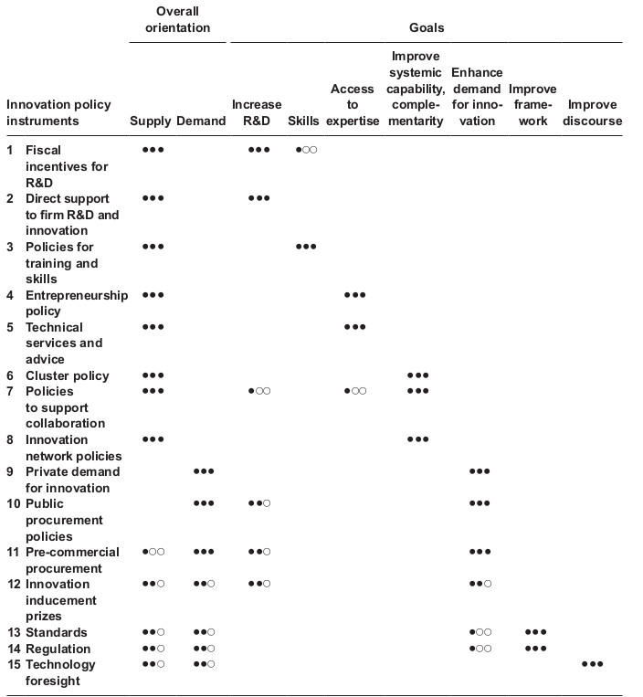

```{r echo=TRUE, include=FALSE}

library(tidyverse)
library(ggplot2)
library(highcharter)


```

<center>UNIVERSIDADE FEDERAL DE MINAS GERAIS</center>

<center><medium>Centro de Desenvolvimento e Planejamento Regional</medium></center>

<br>

<center>CIÊNCIA DE DADOS PARA ESTUDOS EM INOVAÇÃO</center>

<br>

<center>Módulo: **Políticas de inovação**</center>

<br>

<center>Semestre 2022/1</center>

<br>

<center>Professor: Rodrigo Fileto Cuerci Maciel</center>

# Objetivos desta aula

-   Apresentar conceitos de sistema de inovação e políticas de inovação;

-   Trazer especificamente conceitos de compras públicas para inovação.

# Material de aula

O Material desta aula bem como *scripts* utilizados encontram-se em [repositório aberto no Github](https://github.com/rodfileto-ufmg/ciencia_dados_inova/blob/main/04_politicas_inovacao/apresenta%C3%A7%C3%A3o/Apresenta%C3%A7%C3%A3o_pol_inovacao.html){target="_blank"}.

# Tópicos

1.  Sistemas Nacionais de Inovação;

2.  Sistemas Setoriais de Inovação;

3.  Políticas de Inovação;

4.  Compras públicas para fomento de inovação.

# Sistemas Nacionais de Inovação

-   A abordagem dos Sistemas Nacionais de Inovação consideram o contexto nacional como elemento específico e importante para a criação e absorção de conhecimento. Como consequência, países serão diferentes em seus processos de desenvolvimento e difusão de conhecimento bem como pelo conjunto de indústrias abrigam [@nelson1993].

-   Considera-se que a evolução técnica vem acompanhada de um processo de transformação social que congrega a diversidade de atores sociais e cenários políticos e econômicos próprios de uma nação. Ou seja, existe um arcabouço legal e cultural específico que potencializa, seleciona e/ou inibe a difusão de conhecimento técnico necessário para o processo de inovação [@freeman1997].

-   No livro de Ciência e Tecnologia [@rapini2021] a parte 3 se concentra em discutir conceitos e elementos de um Sistema Nacional de Inovação.

*"No Estado industrial a indústria das massas é iluminada pela ciência, e as ciências e as artes são apoiadas pelas indústrias das massas. [...] Nenhum progresso, nenhuma descoberta e invenção, pode ser feita nessas ciências pelo qual centenas de indústrias e processos não possam ser alterados ou melhorados. [...] Os efeitos desses melhoramentos são logo depois estendidos mesmo para a agricultura."* ([@list2011, p. 100, tradução nossa]

# Sistemas Setoriais de inovação

Diferentes setores implicam em diferentes lógicas de desenvolvimento e experiência ao longo do tempo. Os elementos básicos de um Sistema Setorial de Inovação são os seguintes [@malerba2002]:

-   Produtos

-   Agentes: firmas e demais organizações;

-   Conhecimento e processos de aprendizagem;

-   Mecanismos de interação dentro e entre as firmas;

-   Processos de competição e seleção;

-   Instituições;

# Políticas de Inovação

Diferenciação feita por Bittencourt e Rauen  [-@bittencourt2021, p. 523] entre política de inovação implícita e explícita

-   **Política de inovação explícita**: formas direta de participação governamental com "instrumentos de fomento creditício, investimento direto, subvenção, criação de infraestrutura" bem como outros meios que estimulem e/ou regulem a invenção e difusão de conhecimento científico e tecnológico pela sociedade.

-   **Política de inovação implícita:** aquelas que impactariam as atividades de invenção e difusão de conhecimento "a partir dos grandes objetivos macro e microeconômicos nacionais. [...] expressas pela política fiscal e monetária, pelas estratégias educacionais, pela orientação diplomática, pelas regras de controle e accountability, etc."

## Classificação de políticas de inovação

Dentre as políticas de inovação, consideramos ainda classificá-las em quatro principais tipos.

*Políticas orientadas à difusão* seriam aquelas voltadas para a criação e difusão de conhecimento para ajustar a mudança tecnológica de toda estrutura da indústria com investimentos dominados por esquemas de natureza horizontais [@borrás2015].

*Políticas orientadas à missão* (*mission-oriented*): A partir desse instrumental, não apenas o ritmo, mas a direção de desenvolvimento tecnológico é guiado pelo Estado. Tal política tem como vantagem o foco no desenvolvimento de ferramentas tecnológicas relacionadas a uma necessidade, que pode ser de segurança, educação, energia limpa, mobilidade dentre outras. Além disso, a partir da criação de objetivos tecnológicos que ocorre a interação, a qual propicia a troca de informação e conhecimento, entre os vários setores industriais envolvidos na missão [@ergas1987; @mazzucato2014].

*Políticas orientadas ao sistema*: Focadas em agir no processo de interação entre os atores e em suas potencialidades e fraquezas. Toma em consideração as rede de relacionamento entre os diversos atores envolvidos no processo de difusão de conhecimento para inovação [@edler2017].

*Políticas orientadas à invenção.* Com foco mais limitado se comparadas aos tipos anteriores, são concentradas na fase de P&D deixando a fase de difusão e exploração das tecnologias para o mercado [@edler2017].

## Taxonomia de instrumentos de políticas de inovação

```{r echo=FALSE, out.width="100%"}



```

Fonte: [@edler2017, p.12]

## Perigos ao analisar políticas de inovação

1.  Idealizando racionalidades e tomadores de decisão: Assim como se rejeitou a firma representativa (em uma perspectiva evolucionária) não há que se considerar um tomador de decisão representativo.

2.  Tratando políticas como ferramentas dispostas numa caixa;

3.  Muita fé no design racional e coordenação;

4.  Abordagem atemporal para a análise política: pesquisadores de inovação discorrem sobre a importância do travamento na trajetória (*path dependency*) porém raramente consideram processos políticos com essa perspectiva.

# Contexto importa: Política de internacionalização de cientistas

Robinson-Garcia e Rafols [-@robinson-garcia2019] explicam como diferentes contextos nacionais tratam o processo de internacionalização da ciência de forma diferente.

## Política de internacionalização de cientistas

Colaboração internacional e publicação em inglês aumenta a visibilidade das publicações. Isto gera um maior número de citações [@wagner2017; @leydesdorff2019].

Entretanto, outras considerações podem ser discutidas:

-   Capacidade nacional para desenvolver conhecimento científico de forma independente.

-   Subordinação às agendas de pesquisas de grandes centros;

## Incentivando publicações em inglês

A proporção de publicações em inglês de um dado país é tomada como uma aproximação para analisar a internacionalização científica. Porém, como os dados disponíveis em grandes base de dados são em inglês (Web of Science, Scopus e etc.), uma análise neste sentido pode sofrer do viés de seleção.

-   Isso afeta especialmente as ciências sociais uma vez que possuem tendência para publicação em jornais locais e para audiências mais diversificadas.

------------------------------------------------------------------------

## Fração de publicações em inglês no Scielo por área científica

```{r echo=FALSE, message=FALSE, warning=FALSE, out.width="100%"}

document_language <- read_csv("./dados/document_language.csv") %>%
  filter(year_published_scielo <= 2021 & (!(is.na(subject))))

hchart(document_language, "line", hcaes(x = year_published_scielo, y = round(100*(prop), digits = 2), group = subject)) %>%
  hc_yAxis(labels = list(format = "{value}%", style = list(color = "#525151",
                                                           font= '15px Helvetica',
                                                           fontWeight = "bold")), title = list(text = "")) %>%
  hc_xAxis(title = list(text = ""), labels = list(style = list(color = "#525151",
                                                               font= '15px Helvetica',
                                                               fontWeight = "bold"
                                                           )))

```

<details>

<summary>

<medium>Clique aqui para ver o código deste gráfico</medium>

</summary>

```{r echo=TRUE, message=FALSE, warning=FALSE, results='hide'}

library(highcharter)

# https://jkunst.com/highcharter/

document_language <- read_csv("./dados/document_language.csv") %>%
  filter(year_published_scielo <= 2021 & (!(is.na(subject))))
  
hchart(document_language, "line", hcaes(x = year_published_scielo, y = round(100*(prop), digits = 2), group = subject)) %>%
  hc_yAxis(labels = list(format = "{value}%"), title = list(text = "")) %>%
  hc_xAxis(title = list(text = ""))


```

</details>

### Mobilização internacional de diferentes ângulos

Diferentes contextos políticos se referindo ao mesmo fenômeno pode levar para a seleção de diferentes indicadores.

-   **União Européia**: ênfase na circulação de cérebros (*brain-circulation*) e promoção de transferência de conhecimento entre estados membros;

-   **Estados Unidos**: Mobilidade relacionada com aquisição de cérebros (*brain-gain*), ou seja, capacidade de atração de cientistas altamente qualificados.

-   **Países menos desenvolvidos**: Risco de evasão de cérebros (*brain-drain*) devido à condições menos atrativas de retenção de cientistas altamente qualificados.

# Compras públicas para inovação

Trata-se de investimento governamental, através de compras ou expectativa de compras, induzindo a inovação seja através de especificação de níveis de performance não atendidos pelos produtos ou processos existentes, seja através do apoio de P&D para produtos e processos que serão adquiridos posteriormente. Exclui-se dessa modalidade o incentivo à P&D quando a agência do governo não tem a intenção de comprar [@vonortas2015].

Caso existam restrições governamentais para aquisição de produtos ou processos de empresas estrangeiras, a aquisição pública serve como uma barreira comercial não tarifária. Além disso, assegura-se a capacidade nacional em determinado setor [@braman2006].

## Compras públicas para inovação no Brasil

-   Definição dada pelo [Programa Espacial Brasileiro](https://www.gov.br/aeb/pt-br/programa-espacial-brasileiro/encomenda-tecnologica-etec){target="_blank"}:

*A Encomenda Tecnológica, também conhecida como ETEC, é um instrumento de
compra pública de inovação, caracterizada pelo estímulo à inovação nas
empresas. Por meio dela, os órgãos e as entidades da administração
pública poderão contratar diretamente ICT pública ou privada, entidades
de direito privado sem fins lucrativos ou empresas , isoladamente ou em
consórcio, voltadas para atividades de pesquisa e de reconhecida
capacitação tecnológica no setor, com vistas à realização de atividades
de pesquisa, desenvolvimento e inovação que envolvam **risco tecnológico**,
para **solução de problema técnico específico** ou **obtenção de produto,
serviço ou processo inovador**.*

-   Definição dada pelo [Tribunal de Contas da União](https://portal.tcu.gov.br/encomenda-tecnologica-etec.htm){target="_blank"}:

*A ETEC pode ser adotada em situações de **falha de mercado** e alto nível de incerteza, ou seja, quando o Estado se depara com um problema ou uma necessidade cuja solução não é conhecida ou não está disponível e envolve risco tecnológico. Nesse tipo de situação, a Administração Pública pode apresentar o problema para o mercado e identificar potenciais interessados em investir no desenvolvimento da solução. São identificados os potenciais interessados que apresentam maior probabilidade de sucesso, com possibilidade de contratação de mais de um.*


## Bases de dados de compras públicas governamentais

- [Portal da Transparência do Governo Federal](https://portaldatransparencia.cgu.gov.br/){target="_blank"}

- [Gastos governamentais dos Estados Unidos](<https://www.usaspending.gov/>[){target="\_blank"};](http://dadosabertos.cnpq.br/pt_BR/dataset){target="_blank"};)

# REFERÊNCIAS
