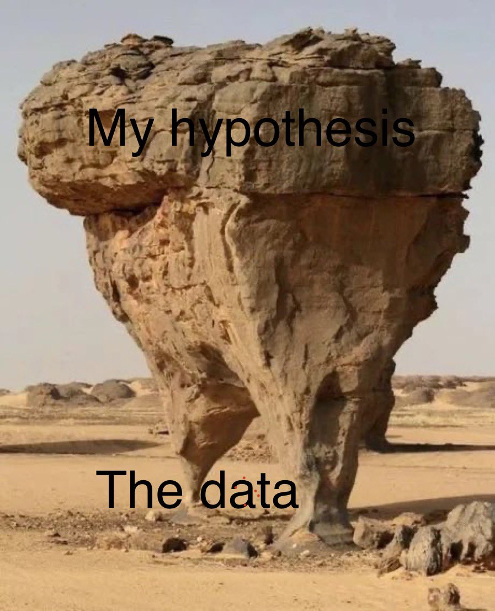
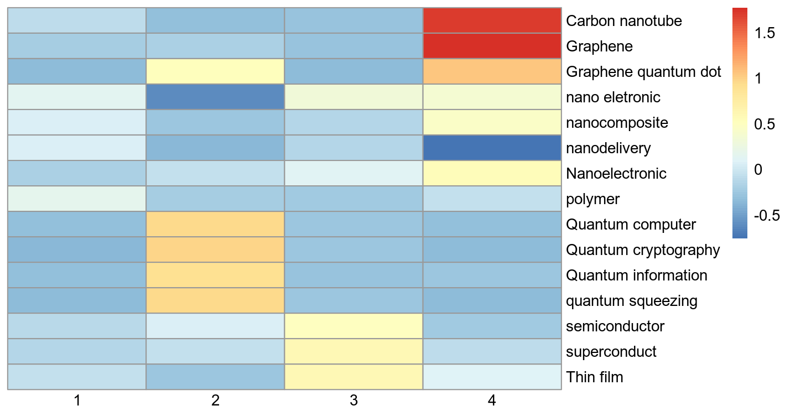

```{r echo=TRUE, include=FALSE}

library(tidyverse)
library(ggplot2)
library(highcharter)


```

<center>UNIVERSIDADE FEDERAL DE MINAS GERAIS</center>

<center><medium>Centro de Desenvolvimento e Planejamento Regional</medium></center>

<br>

<center>CIÊNCIA DE DADOS PARA ESTUDOS EM INOVAÇÃO</center>

<br>

<center>Módulo: **Visualização de dados**</center>

<br>

<center>Semestre 2022/1</center>

<br>

<center>Professor: Rodrigo Fileto Cuerci Maciel</center>

# Objetivos desta aula

-   Apresentar conceitos gerais de visualização de dados;

-   Mostrar alguns exemplos de visualização de dados em R.

    -   `ggplot`

    -   `highcharter`

    -   `igraph`

    -   `visNetwork`

# Material de aula

O Material desta aula bem como *scripts* utilizados encontram-se em
[repositório aberto no
Github](https://github.com/rodfileto-ufmg/ciencia_dados_inova/blob/main/04_politicas_inovacao/apresenta%C3%A7%C3%A3o/Apresenta%C3%A7%C3%A3o_pol_inovacao.html){target="_blank"}.

# O que torna um gráfico ruim?

<center>

Com exceção do último, essas são algumas causas para elaboração de
gráficos ruins extraídos de Healy [-@healy2018].

</center>

-   Mau gosto;

-   Dados ruins;

-   Percepção espacial ruim;

-   Muita informação;

## Mau gosto

```{r echo=FALSE, out.width="30%", fig.align='center'}


```

## Mau gosto

```{r echo=FALSE, out.width="60%", fig.align='center'}

```

## Mau gosto

```{r echo=FALSE, out.width="60%", fig.align='center'}

```

## Dados ruins

```{r echo=FALSE, fig.align='center', out.width="50%"}


```

```{r echo=FALSE, fig.align='center', out.width="50%"}



```


## Dados ruins

```{r echo=FALSE, fig.align='center', out.width="50%"}


```


## Percepação espacial

```{r echo=FALSE, out.width="80%", fig.align='center'}


```

## Muita informação

```{r echo=FALSE, fig.align='center'}



```

<center>Identification of technological paradigms from an information retrieval strategy. The x-axis represents the numbering of the technological paradigms identified. The y-axis shows the query used.</center>


# REFERÊNCIAS
